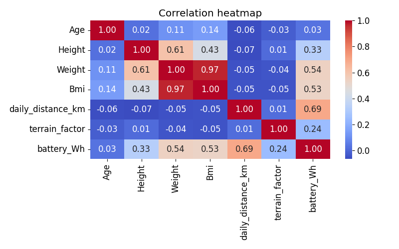
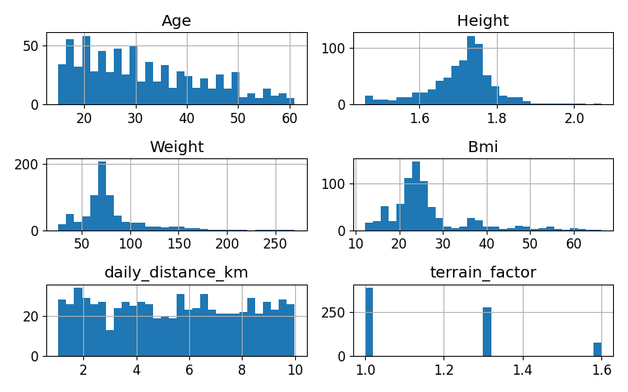
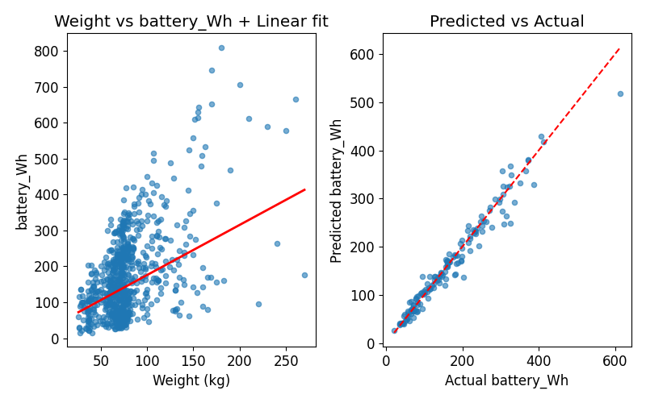
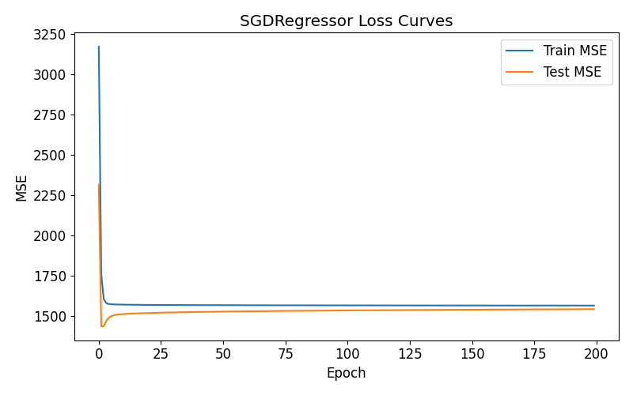

# Battery Energy Prediction Model – Summative Project
## Mission
My mission is to use the power of technology to create and provide personalized assistive tech tools such as automatic wheelchairs and adaptive mobility devices for children with disabilities. By integrating data driven insights into design, I seek to empower mobility, spark playfulness, and enhance well being toward a more inclusive future in the next 5 years.

## Project Overview

This project builds a machine learning model that predicts the required battery capacity (Wh), 1 Wh = 1 watt of power used (or supplied) for 1 hour for a child-specific mobility device. The model uses physical attributes (Height, Weight, BMI), usage patterns (daily distance), and environmental factors (terrain difficulty) to estimate energy needs for safe and optimal design.

This ML system is deployed through:

    1. Task 1 — Linear Regression Model Development
    2. Task 2 — FastAPI Deployment
    3. Task 3 — Flutter Mobile App
    4. Task 4 — Demo Video

## Dataset Description

### Dataset Source

The original dataset was sourced from Kaggle: BMI, Height & Weight Dataset.
It contains 741 clean records and includes:
    Age
    Height (m)
    Weight (kg)
    BMI
    BMI Class

Link to Age, Weight, Height, BMI Analysis Dataset: ('https://www.kaggle.com/datasets/rukenmissonnier/age-weight-height-bmi-analysis/data')

### Feature Engineering

To fit the mobility-battery prediction use case, two new variables were engineered:

    1. daily_distance_km – estimated distance traveled per day
    2. terrain_factor – difficulty multiplier (1.0, 1.3, 1.6)
            
        Terrain factor categorization

            1.0  Smooth (indoor tiles, school halls)
            1.3  Pavement (normal sidewalks, tarmac)
            1.6  Rough (grass, gravel, uneven ground)
This multiplier increases energy consumption to match real-world terrain resistance.

### Target Variable

A synthetic yet realistic target column was generated as `battery_Wh` for estimated energy requirement, based on a physics inspired model combining weight force, distance, and terrain multiplier.

The final dataset is stored as: summative/linear_regression/processed_bmi.csv

## Visualisations

The following visualizations were generated
 #### 1. Correlation Heatmap
 
 #### 2. Feature Distribution Histograms
 
 #### 3. Scatter Plot (Actual vs Predicted)
 
 #### 4. SGDRegressor Loss Curve (Gradient Descent)


All the plots above are under summative/linear_regression/

## Model Development

 ### Feature Processing

    1. Converted Height to meters
    2. Normalized features using StandardScaler
    3. Engineered fields: daily_distance_km, terrain_factor
    4. Removed categorical BMI class (not useful for numeric regression)

 ### Models Implemented

The following models were trained using Scikit-Learn:

    1. Linear Regression
        Simple baseline
        Used for core demonstration of linear modeling

    2. Decision Tree Regressor
        Captures non-linear patterns

    3. Random Forest Regressor
        Best performing model with highest R² and lowest MSE
        Saved as final deployed model

Best model saved are best_model.pkl and scaler.pkl under summative/linear_regression/
Evaluation metrics are stored in summative/linear_regression/model_metrics.csv

 ### Artifacts Automatically Generated

    1. processed_bmi.csv
    2. model_metrics.csv
    3. test_predictions.csv
    4. sgd_loss_curves.png
    5. scatter_before_after.png

## API – FastAPI Deployment

### Key files:

prediction.py – FastAPI server
best_model.pkl – Final ML model
scaler.pkl – Standardization model
requirements.txt – Python dependencies

Starting API
uvicorn prediction:app --reload

### API Features

    FastAPI + Pydantic validation
    Range constraints
    CORS enabled
    Auto docs: http://127.0.0.1:8000/docs

## Flutter App

### Features

Full blue UI theme
Auto BMI calculation
User instructions shown at the top
Terrain options with explanations
Beautiful & responsive layout
Error handling for API & validation
Works on Web, Android Emulator, iOS Simulator, Desktop

### Inputs in the App
    Age
    Height (cm → auto BMI)
    Weight
    Daily distance
    Terrain factor dropdown (smooth / pavement / rough)

### Output

    Predicted battery requirement in Wh
    Real-time API connectivity indicator

### Public API Endpoint:
Publicly deployed my API using render website.
https://linear-regression-model-onnj.onrender.com/predict

Swagger Docs:
https://linear-regression-model-onnj.onrender.com/docs


## Project Folder Structure

```
linear_regression_model/
└── summative/
|   ├── linear_regression/
|   |   ├── data/
|   |   |     └──bmi.csv                  # My initial Dataset
|   │   ├── multivariate.ipynb            # notebook (EDA, training, plots)
|   │   ├── processed_bmi.csv             # processed dataset (Age,Height,Weight,Bmi,BmiClass,daily_distance_km,terrain_factor,battery_Wh)
|   |   ├── process_data.py
|   |   ├── train.py
|   |   ├── 
|   |   ├── 
|   |   ├── 
|   │   └── model_metrics.csv
|   ├── API/
|   │   ├── prediction.py                 # FastAPI app
|   │   ├── requirements.txt
|   │   ├── best_model.pkl  
|   │   └── scaler.pkl                    # saved StandardScaler
|   └── FlutterApp/
|       ├──lrmodelapp/                    #Flutter App
|           ├── lib/
|           │   └── main.dart 
|           ├── pubspec.yaml               
|           └── README.md                     #Flutter Readme
└──README.md

```

## Quick description of what each file does
- `process_data.py` — creates `summative/linear_regression/processed_bmi.csv` by adding reproducible engineered features `daily_distance_km` and `terrain_factor` and computes `battery_Wh` (target).
- `train.py` — training pipeline: EDA images, standardization, trains LinearRegression, SGDRegressor (GD), DecisionTree, RandomForest; saves `best_model.pkl`, `scaler.pkl`, metrics and images.
- `summative/linear_regression/multivariate.ipynb` — the notebook with step-by-step cells (EDA, feature engineering, modeling, plots, saving artifacts).
- `summative/API/prediction.py` — FastAPI app exposing `/predict` (POST) using Pydantic for validation and CORS middleware.
- `summative/API/requirements.txt` — required Python packages for the API.
- `summative/FlutterApp/lib/main.dart` — single page Flutter app that posts to the API and displays predictions.
- `summative/linear_regression/*.png` and `.csv` — saved outputs and figures for reporting and the demo.


## How to prepare and run 
**1. Place your raw dataset**
- Put your raw (unprocessed) CSV named `bmi.csv` at:


**2. Process the data**
```bash
cd linear_regression_model
python process_data.py
# creates summative/linear_regression/processed_bmi.csv

python train.py
# creates artifacts in summative/linear_regression/: best_model.pkl, scaler.pkl, model_metrics.csv, test_predictions.csv, sgd_loss_curves.png, scatter_before_after.png


cp summative/linear_regression/best_model.pkl summative/API/
cp summative/linear_regression/scaler.pkl summative/API/

cd summative/API
pip install -r requirements.txt
uvicorn prediction:app --host 0.0.0.0 --port 8000
# Open http://127.0.0.1:8000/docs to test (Swagger UI)
